# Architecture du projet AAM Frontend

Ce document décrit l'architecture actuelle du projet `AAM-frontend` après lecture des fichiers de configuration, du shell React, des composants, des pages, de la couche API, du store de profil et de l'intégration Electron.

Le projet est une application desktop Electron avec une interface React/Vite. Le frontend dialogue principalement avec un backend local expose sur `http://127.0.0.1:8000`, et Electron sert de conteneur desktop avec un pont IPC limite pour la persistance locale du profil.

## Vue Globale

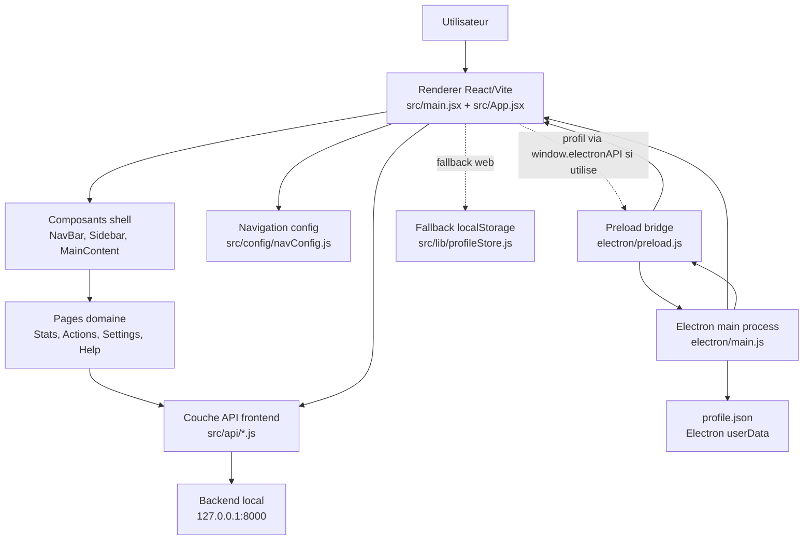

### Responsabilites principales

| Zone | Fichiers | Role |
|---|---|---|
| Conteneur desktop | `electron/main.js`, `electron/preload.js` | Cree la fenetre Electron, charge Vite ou `dist/index.html`, expose `window.electronAPI.profile`. |
| Entree React | `src/main.jsx`, `src/App.jsx` | Monte React, initialise profil/session, gere navigation, onboarding et launcher de session. |
| Navigation | `src/config/navConfig.js` | Source unique pour les sections et sous-pages. Il n'y a pas de routeur externe. |
| Shell UI | `src/components/NavBar.jsx`, `Sidebar.jsx`, `MainContent.jsx` | Affiche la barre haute, la navigation secondaire et la page active. |
| Pages | `src/pages/**` | Vues metier: statistiques, actions, reglages, aide. |
| API frontend | `src/api/profile.js`, `session.js`, `actions.js` | Appels HTTP vers le backend local. |
| Profil local | `src/lib/profileStore.js`, `electron/main.js` | Normalisation du profil et persistance locale possible via Electron ou `localStorage`. |
| Styles | `src/App.css`, `src/index.css`, CSS par composant/page | Tokens globaux, layout desktop, styles des modules. |

## Carte Mentale

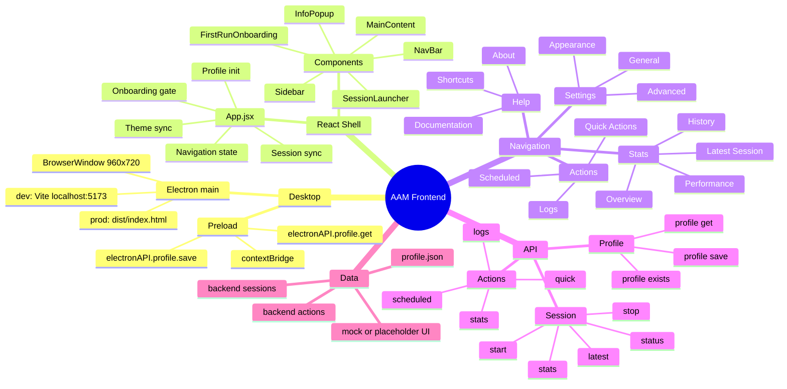

## Structure Du Projet

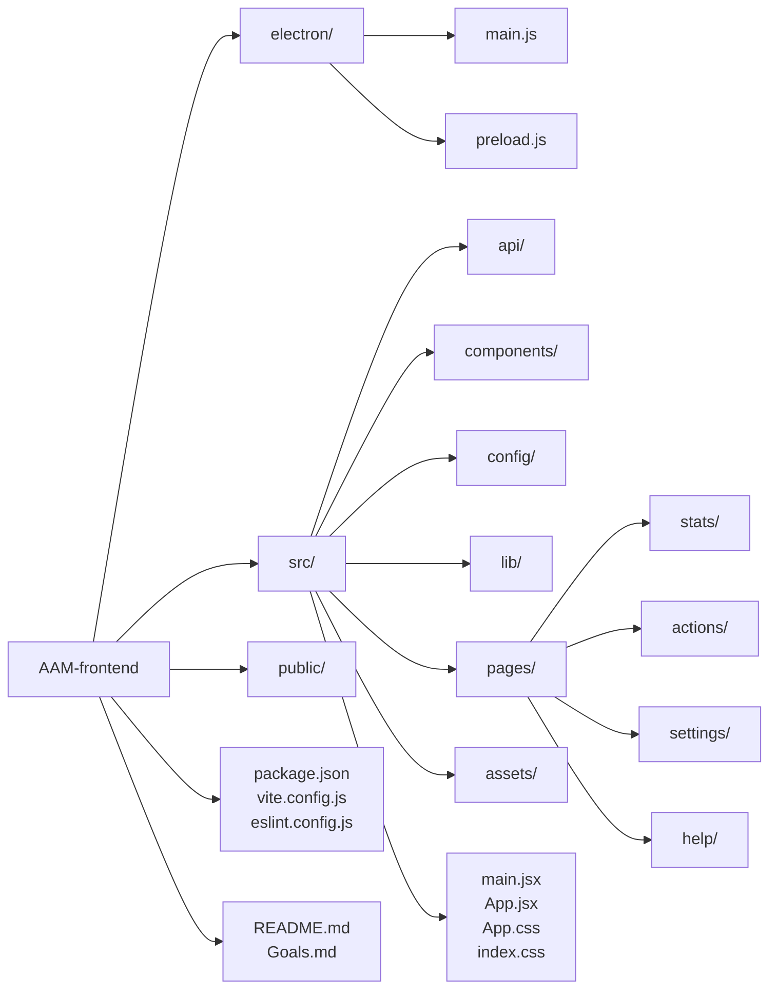

## Pipeline De Demarrage

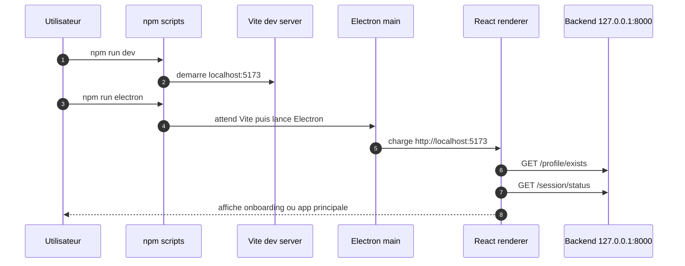

### Scripts disponibles

| Script | Effet |
|---|---|
| `npm run dev` | Lance le serveur Vite sur le port `5173`. |
| `npm run build` | Build le renderer dans `dist/`. |
| `npm run preview` | Sert le build Vite localement. |
| `npm run lint` | Lance ESLint. |
| `npm run electron` | Attend `localhost:5173`, puis lance Electron. |
| `npm run electron:dev` | Lance Vite et Electron ensemble avec `wait-on`. |
| `npm run electron:build` | Build Vite puis lance Electron. |

## Architecture React

`App.jsx` est le centre de coordination. Il gere:

- l'etat de navigation: `activeNav` et `activeSub`;
- le chargement du profil;
- la decision d'afficher l'onboarding ou l'application;
- la synchronisation periodique du statut de session;
- le demarrage et l'arret d'une session;
- l'application du theme dans `document.documentElement`.

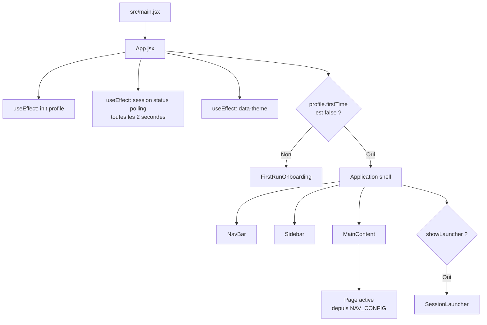

## Pipeline Navigation Et Rendu

La navigation n'utilise pas `react-router`. La configuration `NAV_CONFIG` contient les sections, les sous-sections et les composants a rendre.

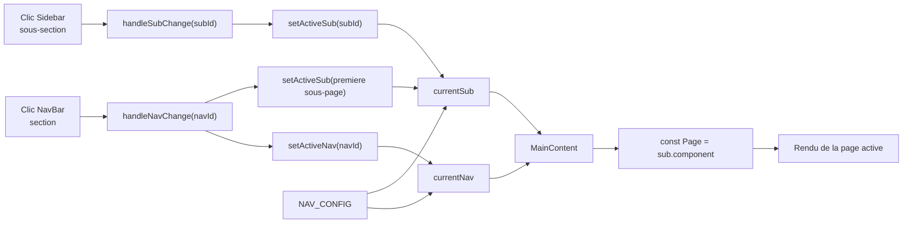

### Table des routes internes

| Section | Sous-pages | Composants |
|---|---|---|
| `stats` | `overview`, `latest`, `performance`, `history` | `StatsOverview`, `LatestSession`, `StatsPerformance`, `StatsHistory` |
| `actions` | `quick`, `scheduled`, `logs` | `QuickActions`, `ScheduledActions`, `ActionLogs` |
| `settings` | `general`, `appearance`, `advanced` | `GeneralSettings`, `AppearanceSettings`, `AdvancedSettings` |
| `help` | `docs`, `shortcuts`, `about` | `Documentation`, `Shortcuts`, `About` |

Pour ajouter une page, il faut creer le composant, l'importer dans `navConfig.js`, puis l'ajouter dans le tableau `subtopics`.

## Pipeline Profil Et Onboarding

Il existe deux chemins de profil dans le code:

- le chemin actuellement utilise par `App.jsx` et `FirstRunOnboarding.jsx`: appels HTTP vers le backend via `src/api/profile.js`;
- le chemin Electron/local fallback dans `src/lib/profileStore.js`, capable d'utiliser `window.electronAPI.profile` ou `localStorage`.

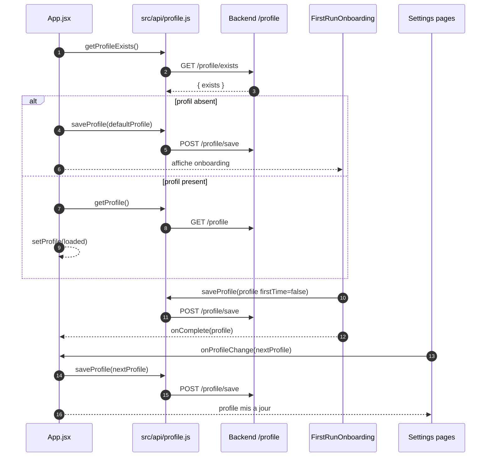

### Modele de profil

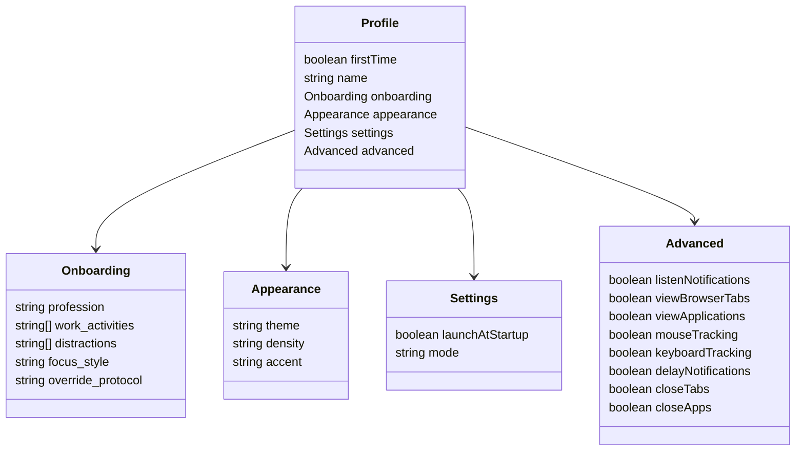

### Etat onboarding

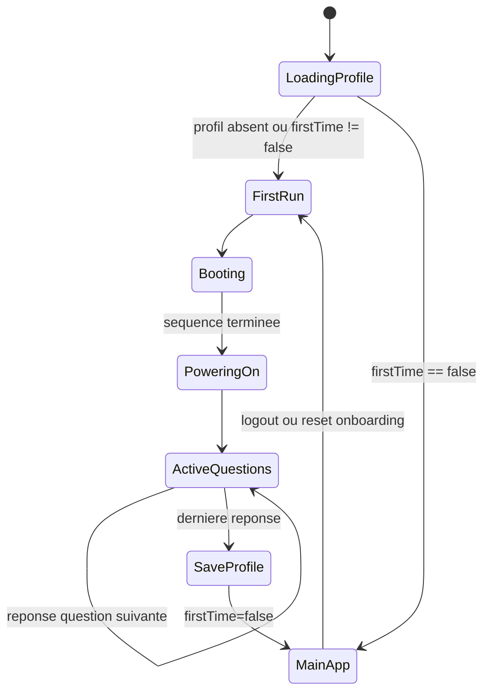

## Pipeline Session

La session est pilotee depuis `NavBar` et `SessionLauncher`, puis confirmee par le backend via polling.

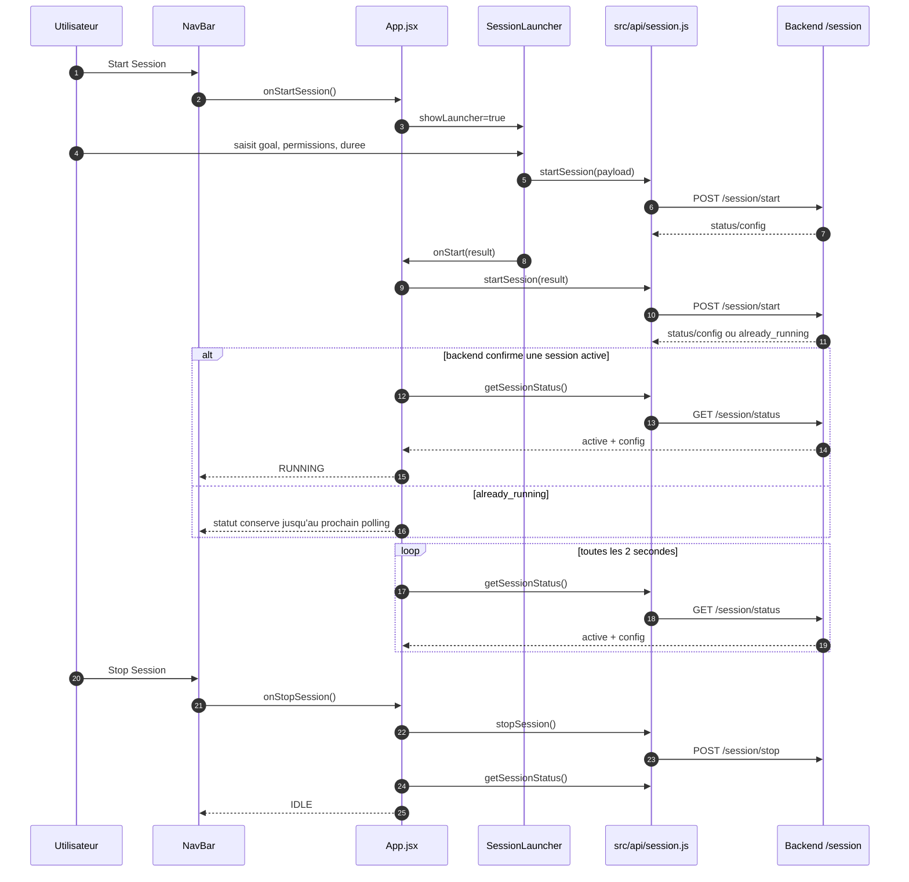

### Payload envoye au demarrage

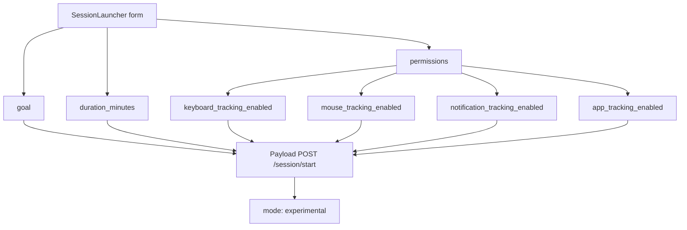

## Pipelines De Donnees Des Pages

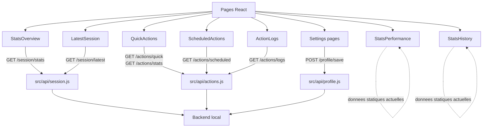

### Endpoints consommes actuellement

| Module | Endpoint | Methode | Utilisation |
|---|---:|---:|---|
| `api/profile.js` | `/profile/exists` | `GET` | Savoir si un profil existe. |
| `api/profile.js` | `/profile` | `GET` | Charger le profil. |
| `api/profile.js` | `/profile/save` | `POST` | Sauvegarder profil, onboarding, reglages. |
| `api/session.js` | `/session/start` | `POST` | Demarrer une session. |
| `api/session.js` | `/session/stop` | `POST` | Arreter une session. |
| `api/session.js` | `/session/status` | `GET` | Synchroniser le statut de session. |
| `api/session.js` | `/session/latest` | `GET` | Afficher la derniere session terminee. |
| `api/session.js` | `/session/stats` | `GET` | Alimenter le tableau de bord global. |
| `api/actions.js` | `/actions/quick` | `GET` | Lister les actions rapides. |
| `api/actions.js` | `/actions/stats` | `GET` | Recuperer les metriques d'actions. |
| `api/actions.js` | `/actions/scheduled` | `GET` | Recuperer la timeline d'automatisation. |
| `api/actions.js` | `/actions/logs` | `GET` | Recuperer les logs d'actions. |

## Pipeline Stats

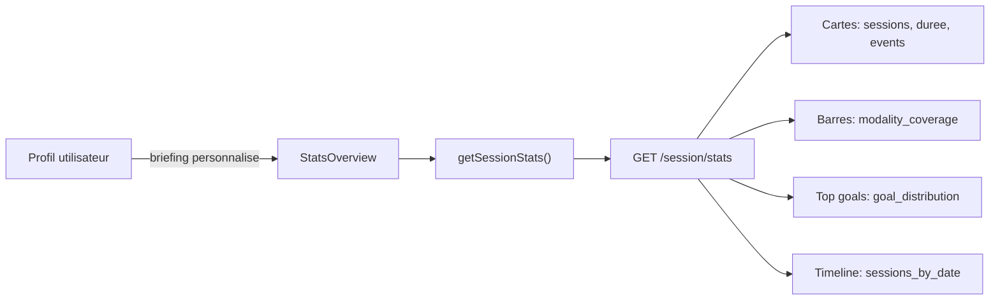

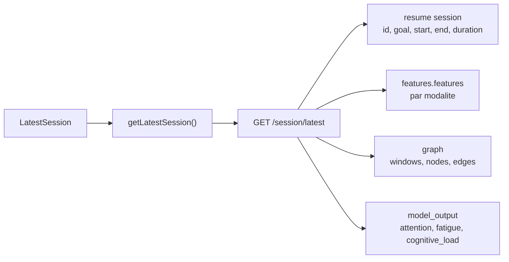

`StatsPerformance` et `StatsHistory` utilisent encore des tableaux statiques. `Goals.md` indique que ces vues doivent etre remplacees progressivement par des reponses backend, notamment autour des features, graphes et predictions.

## Pipeline Actions

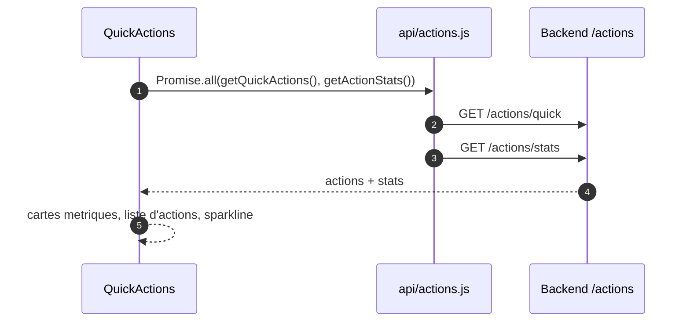

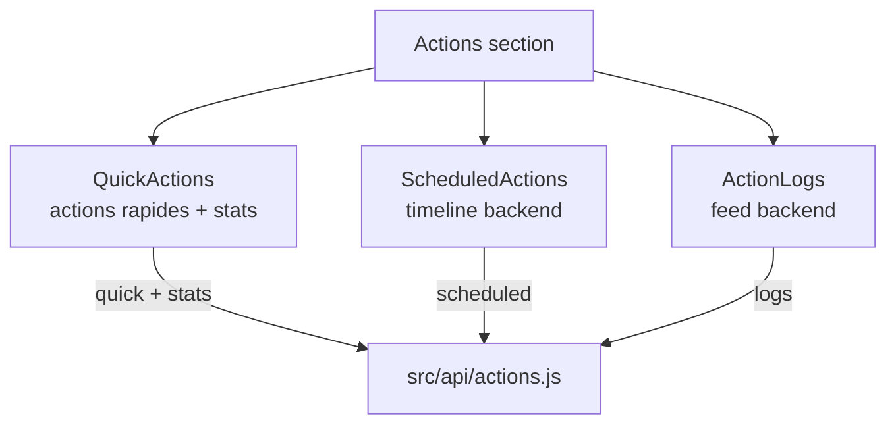

## Pipeline Settings

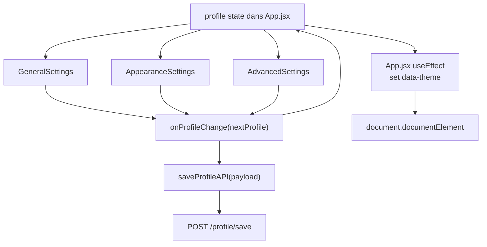

Les reglages generaux modifient `name`, `profession`, `focus_style`, `launchAtStartup` et `mode`.
Les reglages d'apparence modifient `appearance.theme`, `appearance.density` et `appearance.accent`.
Les reglages avances modifient `advanced` et peuvent remettre `firstTime` a `true` pour relancer l'onboarding.

## Integration Electron

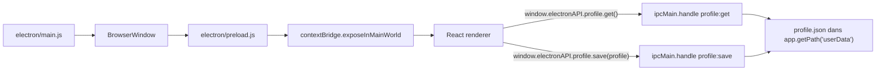

Point important: le shell React actuel (`App.jsx`) utilise `src/api/profile.js`, donc le backend `/profile/*`, plutot que `src/lib/profileStore.js`. Le pont Electron reste disponible pour un mode offline/local ou pour une future reunification du stockage.

## Etat Actuel Des Donnees

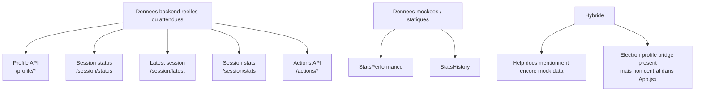

## Pipeline Cible Indique Par Goals.md

`Goals.md` decrit la prochaine etape: supprimer les donnees mockees et connecter davantage de sorties backend.

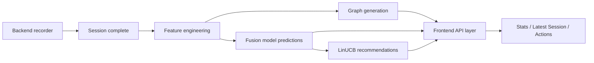

Endpoints cibles cites ou suggeres:

| Endpoint cible | But |
|---|---|
| `/session/latest/features` | Afficher les features clavier, souris, notifications, systeme, contexte. |
| `/session/latest/predictions` | Afficher attention, fatigue, cognitive load et autres sorties modele. |
| `/session/latest/graph` ou `/graphviewer/latest` | Visualiser les transitions, noeuds et relations d'activite. |
| `/session/latest/recommendations` | Afficher recommandations, pauses, interventions et actions personnalisees. |

## Dependances Et Build

```mermaid
flowchart LR
  React["react + react-dom"]
  Vite["vite + @vitejs/plugin-react"]
  Electron["electron"]
  WaitOn["wait-on"]
  Icons["lucide-react"]
  ESLint["eslint + plugins"]
  App["AAM frontend"]

  React --> App
  Vite --> App
  Electron --> App
  WaitOn --> App
  Icons --> App
  ESLint --> App
```

Remarques:

- `src/api/profile.js` importe `axios`.
- `package-lock.json` contient `axios`, mais `package.json` ne le liste pas dans `dependencies`.
- `src/api/session.js` et `src/api/actions.js` utilisent `fetch`.
- `src/index.css` contient encore des tokens generiques de template Vite, tandis que le layout reel est surtout dans `src/App.css` et les CSS de pages/composants.

## Risques Et Points D'Attention

| Sujet | Observation | Impact possible |
|---|---|---|
| Deux systemes de profil | Backend `/profile/*` et `profileStore` Electron/local coexistent. | Risque de divergence si les deux sont utilises en meme temps. |
| `axios` non declare dans `package.json` | Import present dans `src/api/profile.js`, lockfile present. | Installation propre peut echouer si `node_modules` est regenere uniquement depuis `package.json`. |
| SessionLauncher appelle aussi `startSession` | `SessionLauncher` appelle `startSession(payload)`, puis `App.handleSessionStart` rappelle `startSession(config)` car `onStart` recoit le resultat et non le payload attendu. | Risque de double appel `/session/start` ou de payload incorrect au second appel. |
| Donnees mockees restantes | `StatsPerformance`, `StatsHistory` et certains textes d'aide restent statiques. | Les dashboards peuvent donner une impression de donnees reelles alors que certaines vues ne le sont pas. |
| Backend hardcode | Les URLs API sont codees en dur sur `http://127.0.0.1:8000`. | Changement d'environnement plus difficile sans variable de configuration. |
| Raccourcis non branches | `Help/Shortcuts.jsx` liste des raccourcis, mais aucune logique globale ne les implemente. | Documentation utilisateur potentiellement trompeuse. |

## Lecture Rapide Pour Developpeur

```mermaid
flowchart TD
  ChangePage["Ajouter une page"]
  ChangePage --> CreateComponent["Creer composant dans src/pages/..."]
  CreateComponent --> ImportNav["Importer dans navConfig.js"]
  ImportNav --> AddSubtopic["Ajouter subtopic avec component"]
  AddSubtopic --> DonePage["NavBar, Sidebar et MainContent la rendent automatiquement"]

  AddApi["Ajouter un flux backend"]
  AddApi --> ApiWrapper["Creer/etendre wrapper dans src/api"]
  ApiWrapper --> PageEffect["Appeler depuis useEffect de la page"]
  PageEffect --> LoadingError["Ajouter loading et error state"]
  LoadingError --> RenderData["Rendre cartes, listes ou graphes"]

  ChangeProfile["Modifier le profil"]
  ChangeProfile --> SettingsPage["Passer par Settings page"]
  SettingsPage --> OnProfileChange["onProfileChange(nextProfile)"]
  OnProfileChange --> SaveBackend["POST /profile/save"]
  SaveBackend --> AppState["setProfile(payload)"]
```

## Resume

AAM Frontend est un shell desktop React/Electron centre sur quatre domaines: statistiques, actions, reglages et aide. La navigation est entierement declarative via `NAV_CONFIG`. `App.jsx` est l'orchestrateur principal: il charge le profil, decide l'onboarding, synchronise le statut de session, applique le theme et rend la page active.

Le backend local est deja branche pour les profils, sessions, statistiques et actions. La prochaine evolution architecturale consiste a supprimer les donnees mockees restantes, unifier le stockage de profil, parametrer l'URL backend, puis connecter les pipelines de features, graphes, predictions et recommandations decrits dans `Goals.md`.
